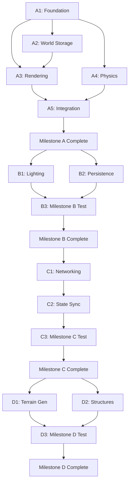

# Implementation Plan: Rust Voxel Game Engine (mdminecraft)

**Document Version:** 1.0
**Date:** 2025.11.12
**Project:** mdminecraft - Rust Voxel Sandbox Engine
**Based on:** 2025.11.12 - HLD - Rust Voxel Game Engine.md
**Estimated Timeline:** 14-19 weeks (4 milestones)

---

## 0. Plan Overview

### 0.1 Implementation Strategy

This plan breaks down the High-Level Design into actionable implementation stages. Each milestone is subdivided into phases, with specific tasks, dependencies, and validation criteria.

**Key Principles:**
- **Bottom-Up Development**: Core primitives → World systems → Rendering → Networking
- **Test-First**: Write tests before implementation where possible
- **Incremental Validation**: Each phase produces a runnable artifact
- **Parallel Work Streams**: Independent crates can be developed concurrently

### 0.2 Milestone Summary

| Milestone | Duration | Goal | Key Deliverable |
|-----------|----------|------|-----------------|
| **A: Engine Core** | 4-6 weeks | Render static world with player movement | `superflat_basics.worldtest.toml` passes |
| **B: Lighting & Persistence** | 3-4 weeks | Dynamic lighting + save/load | `torch_lighting.worldtest.toml` passes |
| **C: Networking** | 4-5 weeks | Multiplayer over LAN | `multiplayer_tower.worldtest.toml` passes |
| **D: Biomes & Structures** | 3-4 weeks | Rich terrain generation | `biome_boundary.worldtest.toml` passes |

### 0.3 Team Organization (if applicable)

**Suggested Work Streams (can be parallelized):**
- **Stream 1 (Core/ECS)**: Foundation crates, ECS setup
- **Stream 2 (World)**: Generation, chunks, lighting
- **Stream 3 (Render)**: Meshing, wgpu renderer, camera
- **Stream 4 (Testing)**: Testkit, event bus, DSL parser
- **Stream 5 (Network)**: Protocol, server/client (Milestone C only)

### 0.4 Development Environment Setup

**Prerequisites (Week 0):**
```bash
# Rust toolchain
curl --proto '=https' --tlsv1.2 -sSf https://sh.rustup.rs | sh
rustup update stable
rustup component add clippy rustfmt

# Development tools
cargo install cargo-watch cargo-nextest cargo-flamegraph

# Graphics dependencies (Linux)
sudo apt-get install libvulkan-dev vulkan-tools

# Graphics dependencies (macOS)
# Xcode command line tools required

# Graphics dependencies (Windows)
# Visual Studio 2019+ with C++ tools
```

**Project Initialization:**
```bash
# Create workspace
cargo new --name mdminecraft --lib .
mkdir -p crates/{core,ecs,world,physics,render,net,server,client,assets,scripting,testkit,cli}

# Initialize each crate
for crate in core ecs world physics render net server client assets scripting testkit cli; do
    cargo init --lib crates/$crate
done

# Create binary crates
cargo init crates/cli/src/bin/game-client.rs
cargo init crates/cli/src/bin/game-server.rs
cargo init crates/cli/src/bin/worldtool.rs
cargo init crates/cli/src/bin/worldtest.rs
```

---

## 1. Milestone A: Engine Core (4-6 weeks)

**Goal:** Render a static voxel world with player movement and collision

### Phase A1: Foundation Crates (Week 1)

#### Task A1.1: Workspace Setup
**Owner:** Stream 1
**Estimated Time:** 2 days
**Dependencies:** None

**Implementation Steps:**
1. Create root `Cargo.toml` with workspace members:
```toml
[workspace]
members = [
    "crates/core",
    "crates/ecs",
    "crates/world",
    "crates/physics",
    "crates/render",
    "crates/net",
    "crates/server",
    "crates/client",
    "crates/assets",
    "crates/scripting",
    "crates/testkit",
    "crates/cli",
]
resolver = "2"

[workspace.package]
version = "0.1.0"
edition = "2021"
rust-version = "1.75"
license = "MIT OR Apache-2.0"

[workspace.dependencies]
# Shared dependencies
glam = { version = "0.24", features = ["serde"] }
serde = { version = "1.0", features = ["derive"] }
thiserror = "1.0"
tracing = "0.1"
```

2. Set up CI pipeline (`.github/workflows/ci.yml`):
```yaml
name: CI
on: [push, pull_request]
jobs:
  test:
    runs-on: ${{ matrix.os }}
    strategy:
      matrix:
        os: [ubuntu-latest, windows-latest, macos-latest]
    steps:
      - uses: actions/checkout@v3
      - uses: actions-rs/toolchain@v1
        with:
          toolchain: stable
          components: clippy, rustfmt
      - run: cargo fmt --all -- --check
      - run: cargo clippy --all-targets -- -D warnings
      - run: cargo test --all-features
```

3. Configure `rustfmt.toml` and `clippy.toml`

**Validation:**
- [ ] `cargo build --workspace` succeeds
- [ ] `cargo fmt --check` passes
- [ ] CI runs on push

---

#### Task A1.2: Core Crate - Math & Primitives
**Owner:** Stream 1
**Estimated Time:** 3 days
**Dependencies:** A1.1

**Implementation Steps:**

1. **`core/src/math.rs`**: Coordinate types
```rust
use glam::{IVec3, Vec3};

/// World position in voxel coordinates
pub type BlockPos = IVec3;

/// Chunk position (world_pos / CHUNK_SIZE)
pub type ChunkPos = IVec3;

/// World position in floating-point coordinates
pub type WorldPos = Vec3;

pub const CHUNK_SIZE: i32 = 16;
pub const CHUNK_HEIGHT: i32 = 256;

/// Convert world position to chunk position
pub fn world_to_chunk(pos: BlockPos) -> ChunkPos {
    IVec3::new(
        pos.x.div_euclid(CHUNK_SIZE),
        0, // Chunks span full height
        pos.z.div_euclid(CHUNK_SIZE),
    )
}

/// Convert world position to local chunk position [0, 15]
pub fn world_to_local(pos: BlockPos) -> IVec3 {
    IVec3::new(
        pos.x.rem_euclid(CHUNK_SIZE),
        pos.y,
        pos.z.rem_euclid(CHUNK_SIZE),
    )
}

#[cfg(test)]
mod tests {
    use super::*;

    #[test]
    fn test_world_to_chunk_positive() {
        assert_eq!(world_to_chunk(IVec3::new(0, 0, 0)), IVec3::new(0, 0, 0));
        assert_eq!(world_to_chunk(IVec3::new(16, 0, 16)), IVec3::new(1, 0, 1));
    }

    #[test]
    fn test_world_to_chunk_negative() {
        assert_eq!(world_to_chunk(IVec3::new(-1, 0, -1)), IVec3::new(-1, 0, -1));
    }
}
```

2. **`core/src/block.rs`**: Block definitions
```rust
use serde::{Deserialize, Serialize};

#[derive(Debug, Clone, Copy, PartialEq, Eq, Hash, Serialize, Deserialize)]
pub struct BlockId(pub u16);

impl BlockId {
    pub const AIR: BlockId = BlockId(0);
}

#[derive(Debug, Clone, Copy, PartialEq, Eq, Serialize, Deserialize)]
pub struct BlockState(pub u16);

impl Default for BlockState {
    fn default() -> Self {
        Self(0)
    }
}

#[derive(Debug, Clone, Copy)]
pub struct Voxel {
    pub id: BlockId,
    pub state: BlockState,
    pub light_sky: u8,
    pub light_block: u8,
}

impl Voxel {
    pub const AIR: Voxel = Voxel {
        id: BlockId::AIR,
        state: BlockState(0),
        light_sky: 15,
        light_block: 0,
    };

    pub fn is_air(&self) -> bool {
        self.id == BlockId::AIR
    }
}
```

3. **`core/src/time.rs`**: Tick system
```rust
#[derive(Debug, Clone, Copy, PartialEq, Eq, Hash)]
pub struct Tick(pub u64);

impl Tick {
    pub const ZERO: Tick = Tick(0);
    pub const RATE: u32 = 20; // TPS
    pub const DELTA: f32 = 1.0 / Self::RATE as f32; // 0.05 seconds

    pub fn next(self) -> Tick {
        Tick(self.0 + 1)
    }
}

pub struct TickTimer {
    accumulator: f32,
    current_tick: Tick,
}

impl TickTimer {
    pub fn new() -> Self {
        Self {
            accumulator: 0.0,
            current_tick: Tick::ZERO,
        }
    }

    pub fn update(&mut self, dt: f32) -> Option<Tick> {
        self.accumulator += dt;
        if self.accumulator >= Tick::DELTA {
            self.accumulator -= Tick::DELTA;
            self.current_tick = self.current_tick.next();
            Some(self.current_tick)
        } else {
            None
        }
    }
}
```

4. **`core/src/rng.rs`**: Seeded RNG
```rust
use rand::{Rng, SeedableRng};
use rand_chacha::ChaCha8Rng;

pub struct DeterministicRng {
    rng: ChaCha8Rng,
}

impl DeterministicRng {
    pub fn from_seed(seed: u64) -> Self {
        Self {
            rng: ChaCha8Rng::seed_from_u64(seed),
        }
    }

    pub fn from_world_and_chunk(world_seed: u64, chunk_pos: IVec3) -> Self {
        let hash = world_seed
            ^ (chunk_pos.x as u64)
            ^ ((chunk_pos.z as u64) << 32);
        Self::from_seed(hash)
    }

    pub fn gen_f32(&mut self) -> f32 {
        self.rng.gen()
    }

    pub fn gen_range(&mut self, min: i32, max: i32) -> i32 {
        self.rng.gen_range(min..max)
    }
}
```

**Validation:**
- [ ] All unit tests pass
- [ ] Coordinate conversions handle negatives correctly
- [ ] RNG produces same values for same seed

---

#### Task A1.3: ECS Crate - Bevy ECS Integration
**Owner:** Stream 1
**Estimated Time:** 2 days
**Dependencies:** A1.2

**Implementation Steps:**

1. Add dependencies to `crates/ecs/Cargo.toml`:
```toml
[dependencies]
bevy_ecs = { version = "0.12", default-features = false }
glam = { workspace = true }
```

2. **`ecs/src/components.rs`**: Core components
```rust
use bevy_ecs::prelude::*;
use glam::{Quat, Vec3};

#[derive(Component, Debug, Clone)]
pub struct Transform {
    pub position: Vec3,
    pub rotation: Quat,
}

#[derive(Component, Debug, Clone, Copy)]
pub struct Velocity(pub Vec3);

#[derive(Component, Debug, Clone, Copy)]
pub struct Collider {
    pub radius: f32,
    pub height: f32,
}

#[derive(Component, Debug)]
pub struct PlayerTag;

#[derive(Component, Debug)]
pub struct Health {
    pub current: f32,
    pub max: f32,
}
```

3. **`ecs/src/lib.rs`**: Re-export bevy_ecs
```rust
pub mod components;

pub use bevy_ecs::prelude::*;
pub use components::*;
```

**Validation:**
- [ ] Can create World and spawn entities
- [ ] Can query entities with components
- [ ] Components are Send + Sync

---

### Phase A2: World Storage & Generation (Week 2)

#### Task A2.1: Chunk Storage
**Owner:** Stream 2
**Estimated Time:** 3 days
**Dependencies:** A1.2

**Implementation Steps:**

1. **`world/src/chunk.rs`**: Chunk data structure
```rust
use crate::core::{BlockPos, ChunkPos, Voxel, CHUNK_SIZE, CHUNK_HEIGHT};
use std::collections::HashMap;

pub const CHUNK_VOLUME: usize = (CHUNK_SIZE * CHUNK_HEIGHT * CHUNK_SIZE) as usize;

pub struct Chunk {
    pub position: ChunkPos,
    voxels: Box<[Voxel; CHUNK_VOLUME]>,
    pub generated: bool,
    pub dirty_mesh: bool,
}

impl Chunk {
    pub fn new(position: ChunkPos) -> Self {
        Self {
            position,
            voxels: Box::new([Voxel::AIR; CHUNK_VOLUME]),
            generated: false,
            dirty_mesh: true,
        }
    }

    fn index(x: i32, y: i32, z: i32) -> usize {
        (y * CHUNK_SIZE * CHUNK_SIZE + z * CHUNK_SIZE + x) as usize
    }

    pub fn get_local(&self, x: i32, y: i32, z: i32) -> Option<Voxel> {
        if x < 0 || y < 0 || z < 0 || x >= CHUNK_SIZE || y >= CHUNK_HEIGHT || z >= CHUNK_SIZE {
            return None;
        }
        Some(self.voxels[Self::index(x, y, z)])
    }

    pub fn set_local(&mut self, x: i32, y: i32, z: i32, voxel: Voxel) -> bool {
        if x < 0 || y < 0 || z < 0 || x >= CHUNK_SIZE || y >= CHUNK_HEIGHT || z >= CHUNK_SIZE {
            return false;
        }
        self.voxels[Self::index(x, y, z)] = voxel;
        self.dirty_mesh = true;
        true
    }

    pub fn fill(&mut self, voxel: Voxel) {
        self.voxels.fill(voxel);
        self.dirty_mesh = true;
    }
}

pub struct ChunkManager {
    chunks: HashMap<ChunkPos, Chunk>,
}

impl ChunkManager {
    pub fn new() -> Self {
        Self {
            chunks: HashMap::new(),
        }
    }

    pub fn get_chunk(&self, pos: ChunkPos) -> Option<&Chunk> {
        self.chunks.get(&pos)
    }

    pub fn get_chunk_mut(&mut self, pos: ChunkPos) -> Option<&mut Chunk> {
        self.chunks.get_mut(&pos)
    }

    pub fn insert_chunk(&mut self, chunk: Chunk) {
        self.chunks.insert(chunk.position, chunk);
    }

    pub fn get_voxel(&self, pos: BlockPos) -> Option<Voxel> {
        let chunk_pos = core::world_to_chunk(pos);
        let local = core::world_to_local(pos);
        self.get_chunk(chunk_pos)?
            .get_local(local.x, local.y, local.z)
    }

    pub fn set_voxel(&mut self, pos: BlockPos, voxel: Voxel) -> bool {
        let chunk_pos = core::world_to_chunk(pos);
        let local = core::world_to_local(pos);
        self.get_chunk_mut(chunk_pos)
            .map(|chunk| chunk.set_local(local.x, local.y, local.z, voxel))
            .unwrap_or(false)
    }
}
```

**Validation:**
- [ ] Can create chunks and store voxels
- [ ] World-to-local coordinate conversion works
- [ ] Boundary checks prevent out-of-bounds access

---

#### Task A2.2: Superflat Generator (MVP)
**Owner:** Stream 2
**Estimated Time:** 2 days
**Dependencies:** A2.1

**Implementation Steps:**

1. **`world/src/generation/superflat.rs`**:
```rust
use crate::{Chunk, Voxel, BlockId};

pub fn generate_superflat(chunk: &mut Chunk) {
    // Layers: bedrock (0), stone (1-60), dirt (61-63), grass (64)
    for x in 0..16 {
        for z in 0..16 {
            for y in 0..65 {
                let voxel = match y {
                    0 => Voxel { id: BlockId(1), ..Voxel::AIR }, // Bedrock (placeholder)
                    1..=60 => Voxel { id: BlockId(3), ..Voxel::AIR }, // Stone
                    61..=63 => Voxel { id: BlockId(2), ..Voxel::AIR }, // Dirt
                    64 => Voxel { id: BlockId(1), ..Voxel::AIR }, // Grass
                    _ => Voxel::AIR,
                };
                chunk.set_local(x, y, z, voxel);
            }
        }
    }
    chunk.generated = true;
}
```

**Validation:**
- [ ] Generated chunks have correct layer structure
- [ ] No uninitialized voxels

---

### Phase A3: Rendering Pipeline (Week 3-4)

#### Task A3.1: Greedy Meshing
**Owner:** Stream 3
**Estimated Time:** 4 days
**Dependencies:** A2.1

**Implementation Steps:**

1. **`render/src/vertex.rs`**: Vertex format
```rust
use bytemuck::{Pod, Zeroable};

#[repr(C)]
#[derive(Clone, Copy, Pod, Zeroable)]
pub struct Vertex {
    pub position: [f32; 3],
    pub uv: [f32; 2],
    pub light: [u8; 2], // [sky, block]
    pub ao: u8,
    pub _padding: u8,
}

impl Vertex {
    pub const LAYOUT: wgpu::VertexBufferLayout<'static> = wgpu::VertexBufferLayout {
        array_stride: std::mem::size_of::<Vertex>() as wgpu::BufferAddress,
        step_mode: wgpu::VertexStepMode::Vertex,
        attributes: &[
            // Position
            wgpu::VertexAttribute {
                offset: 0,
                shader_location: 0,
                format: wgpu::VertexFormat::Float32x3,
            },
            // UV
            wgpu::VertexAttribute {
                offset: 12,
                shader_location: 1,
                format: wgpu::VertexFormat::Float32x2,
            },
            // Light
            wgpu::VertexAttribute {
                offset: 20,
                shader_location: 2,
                format: wgpu::VertexFormat::Uint8x2,
            },
            // AO
            wgpu::VertexAttribute {
                offset: 22,
                shader_location: 3,
                format: wgpu::VertexFormat::Uint8,
            },
        ],
    };
}
```

2. **`render/src/meshing/greedy.rs`**: Greedy meshing algorithm
```rust
use crate::Vertex;
use world::{Chunk, CHUNK_SIZE, CHUNK_HEIGHT};

pub struct ChunkMesh {
    pub vertices: Vec<Vertex>,
    pub indices: Vec<u32>,
}

pub fn greedy_mesh(chunk: &Chunk) -> ChunkMesh {
    let mut vertices = Vec::new();
    let mut indices = Vec::new();

    // For each axis (X, Y, Z)
    for axis in 0..3 {
        for direction in [1, -1] {
            mesh_axis(chunk, axis, direction, &mut vertices, &mut indices);
        }
    }

    ChunkMesh { vertices, indices }
}

fn mesh_axis(
    chunk: &Chunk,
    axis: i32,
    direction: i32,
    vertices: &mut Vec<Vertex>,
    indices: &mut Vec<u32>,
) {
    // Determine dimensions based on axis
    let (u_axis, v_axis) = match axis {
        0 => (1, 2), // X: iterate YZ
        1 => (0, 2), // Y: iterate XZ
        2 => (0, 1), // Z: iterate XY
        _ => unreachable!(),
    };

    let (u_max, v_max, w_max) = match axis {
        0 => (CHUNK_HEIGHT, CHUNK_SIZE, CHUNK_SIZE),
        1 => (CHUNK_SIZE, CHUNK_SIZE, CHUNK_HEIGHT),
        2 => (CHUNK_SIZE, CHUNK_HEIGHT, CHUNK_SIZE),
        _ => unreachable!(),
    };

    // Create 2D mask for this slice
    let mut mask = vec![None; (u_max * v_max) as usize];

    // Iterate through slices perpendicular to axis
    for w in 0..w_max {
        // Build mask for this slice
        fill_mask(chunk, axis, direction, w, &mut mask, u_max, v_max);

        // Greedy merge: find rectangular runs
        for v in 0..v_max {
            for u in 0..u_max {
                let idx = (v * u_max + u) as usize;
                if let Some(block_id) = mask[idx] {
                    // Find width
                    let mut width = 1;
                    while u + width < u_max {
                        let next_idx = (v * u_max + u + width) as usize;
                        if mask[next_idx] != Some(block_id) {
                            break;
                        }
                        width += 1;
                    }

                    // Find height
                    let mut height = 1;
                    'height_loop: while v + height < v_max {
                        for du in 0..width {
                            let check_idx = ((v + height) * u_max + u + du) as usize;
                            if mask[check_idx] != Some(block_id) {
                                break 'height_loop;
                            }
                        }
                        height += 1;
                    }

                    // Emit quad
                    emit_quad(
                        axis,
                        direction,
                        u,
                        v,
                        w,
                        width,
                        height,
                        block_id,
                        vertices,
                        indices,
                    );

                    // Clear mask for merged area
                    for dv in 0..height {
                        for du in 0..width {
                            mask[((v + dv) * u_max + u + du) as usize] = None;
                        }
                    }
                }
            }
        }
    }
}

fn fill_mask(
    chunk: &Chunk,
    axis: i32,
    direction: i32,
    w: i32,
    mask: &mut [Option<u16>],
    u_max: i32,
    v_max: i32,
) {
    // Fill mask with visible faces for this slice
    // (Simplified - real implementation checks neighbors)
    for v in 0..v_max {
        for u in 0..u_max {
            let pos = match axis {
                0 => (w, u, v),
                1 => (u, w, v),
                2 => (u, v, w),
                _ => unreachable!(),
            };

            if let Some(voxel) = chunk.get_local(pos.0, pos.1, pos.2) {
                if !voxel.is_air() {
                    // Check if face is exposed (neighbor is air or out of bounds)
                    let neighbor_pos = match axis {
                        0 => (w + direction, u, v),
                        1 => (u, w + direction, v),
                        2 => (u, v, w + direction),
                        _ => unreachable!(),
                    };

                    let neighbor = chunk.get_local(neighbor_pos.0, neighbor_pos.1, neighbor_pos.2);
                    if neighbor.map_or(true, |v| v.is_air()) {
                        mask[(v * u_max + u) as usize] = Some(voxel.id.0);
                    }
                }
            }
        }
    }
}

fn emit_quad(
    axis: i32,
    direction: i32,
    u: i32,
    v: i32,
    w: i32,
    width: i32,
    height: i32,
    block_id: u16,
    vertices: &mut Vec<Vertex>,
    indices: &mut Vec<u32>,
) {
    // Convert to 3D coordinates and emit 4 vertices + 6 indices
    let base_index = vertices.len() as u32;

    // Compute positions based on axis
    let positions = match axis {
        0 => {
            // X-axis face
            let x = w as f32 + if direction > 0 { 1.0 } else { 0.0 };
            [
                [x, u as f32, v as f32],
                [x, u as f32, (v + height) as f32],
                [x, (u + width) as f32, (v + height) as f32],
                [x, (u + width) as f32, v as f32],
            ]
        }
        1 => {
            // Y-axis face
            let y = w as f32 + if direction > 0 { 1.0 } else { 0.0 };
            [
                [u as f32, y, v as f32],
                [u as f32, y, (v + height) as f32],
                [(u + width) as f32, y, (v + height) as f32],
                [(u + width) as f32, y, v as f32],
            ]
        }
        2 => {
            // Z-axis face
            let z = w as f32 + if direction > 0 { 1.0 } else { 0.0 };
            [
                [u as f32, v as f32, z],
                [u as f32, (v + height) as f32, z],
                [(u + width) as f32, (v + height) as f32, z],
                [(u + width) as f32, v as f32, z],
            ]
        }
        _ => unreachable!(),
    };

    // UVs
    let uvs = [
        [0.0, 0.0],
        [0.0, height as f32],
        [width as f32, height as f32],
        [width as f32, 0.0],
    ];

    // Emit vertices
    for i in 0..4 {
        vertices.push(Vertex {
            position: positions[i],
            uv: uvs[i],
            light: [15, 0], // Full skylight for now
            ao: 0,
            _padding: 0,
        });
    }

    // Emit indices (two triangles)
    if direction > 0 {
        indices.extend_from_slice(&[
            base_index,
            base_index + 1,
            base_index + 2,
            base_index,
            base_index + 2,
            base_index + 3,
        ]);
    } else {
        // Reverse winding for backface
        indices.extend_from_slice(&[
            base_index,
            base_index + 3,
            base_index + 2,
            base_index,
            base_index + 2,
            base_index + 1,
        ]);
    }
}
```

**Validation:**
- [ ] Mesh has no holes
- [ ] Quad count < naive meshing
- [ ] Vertices have correct positions

---

#### Task A3.2: wgpu Renderer Setup
**Owner:** Stream 3
**Estimated Time:** 5 days
**Dependencies:** A3.1

**Implementation Steps:**

1. Add dependencies to `render/Cargo.toml`:
```toml
[dependencies]
wgpu = "0.18"
winit = "0.29"
bytemuck = { version = "1.14", features = ["derive"] }
glam = { workspace = true }
```

2. **`render/src/renderer.rs`**: Main renderer
```rust
use wgpu::util::DeviceExt;
use winit::window::Window;

pub struct VoxelRenderer {
    surface: wgpu::Surface,
    device: wgpu::Device,
    queue: wgpu::Queue,
    config: wgpu::SurfaceConfiguration,
    pipeline: wgpu::RenderPipeline,
    camera_buffer: wgpu::Buffer,
    camera_bind_group: wgpu::BindGroup,
    depth_texture: wgpu::Texture,
    depth_view: wgpu::TextureView,
}

impl VoxelRenderer {
    pub async fn new(window: &Window) -> Self {
        let size = window.inner_size();

        // Create instance
        let instance = wgpu::Instance::new(wgpu::InstanceDescriptor {
            backends: wgpu::Backends::all(),
            ..Default::default()
        });

        let surface = unsafe { instance.create_surface(&window) }.unwrap();

        // Request adapter
        let adapter = instance
            .request_adapter(&wgpu::RequestAdapterOptions {
                power_preference: wgpu::PowerPreference::HighPerformance,
                compatible_surface: Some(&surface),
                force_fallback_adapter: false,
            })
            .await
            .unwrap();

        // Request device
        let (device, queue) = adapter
            .request_device(
                &wgpu::DeviceDescriptor {
                    features: wgpu::Features::empty(),
                    limits: wgpu::Limits::default(),
                    label: None,
                },
                None,
            )
            .await
            .unwrap();

        // Configure surface
        let surface_caps = surface.get_capabilities(&adapter);
        let surface_format = surface_caps
            .formats
            .iter()
            .copied()
            .find(|f| f.is_srgb())
            .unwrap_or(surface_caps.formats[0]);

        let config = wgpu::SurfaceConfiguration {
            usage: wgpu::TextureUsages::RENDER_ATTACHMENT,
            format: surface_format,
            width: size.width,
            height: size.height,
            present_mode: surface_caps.present_modes[0],
            alpha_mode: surface_caps.alpha_modes[0],
            view_formats: vec![],
        };
        surface.configure(&device, &config);

        // Load shaders
        let shader = device.create_shader_module(wgpu::ShaderModuleDescriptor {
            label: Some("Voxel Shader"),
            source: wgpu::ShaderSource::Wgsl(include_str!("shaders/voxel.wgsl").into()),
        });

        // Camera uniform buffer
        let camera_buffer = device.create_buffer(&wgpu::BufferDescriptor {
            label: Some("Camera Buffer"),
            size: 128, // mat4x4 view-proj
            usage: wgpu::BufferUsages::UNIFORM | wgpu::BufferUsages::COPY_DST,
            mapped_at_creation: false,
        });

        // Camera bind group layout
        let camera_bind_group_layout =
            device.create_bind_group_layout(&wgpu::BindGroupLayoutDescriptor {
                entries: &[wgpu::BindGroupLayoutEntry {
                    binding: 0,
                    visibility: wgpu::ShaderStages::VERTEX,
                    ty: wgpu::BindingType::Buffer {
                        ty: wgpu::BufferBindingType::Uniform,
                        has_dynamic_offset: false,
                        min_binding_size: None,
                    },
                    count: None,
                }],
                label: Some("Camera Bind Group Layout"),
            });

        let camera_bind_group = device.create_bind_group(&wgpu::BindGroupDescriptor {
            layout: &camera_bind_group_layout,
            entries: &[wgpu::BindGroupEntry {
                binding: 0,
                resource: camera_buffer.as_entire_binding(),
            }],
            label: Some("Camera Bind Group"),
        });

        // Depth texture
        let depth_texture = device.create_texture(&wgpu::TextureDescriptor {
            label: Some("Depth Texture"),
            size: wgpu::Extent3d {
                width: config.width,
                height: config.height,
                depth_or_array_layers: 1,
            },
            mip_level_count: 1,
            sample_count: 1,
            dimension: wgpu::TextureDimension::D2,
            format: wgpu::TextureFormat::Depth32Float,
            usage: wgpu::TextureUsages::RENDER_ATTACHMENT | wgpu::TextureUsages::TEXTURE_BINDING,
            view_formats: &[],
        });

        let depth_view = depth_texture.create_view(&wgpu::TextureViewDescriptor::default());

        // Pipeline layout
        let pipeline_layout = device.create_pipeline_layout(&wgpu::PipelineLayoutDescriptor {
            label: Some("Voxel Pipeline Layout"),
            bind_group_layouts: &[&camera_bind_group_layout],
            push_constant_ranges: &[],
        });

        // Render pipeline
        let pipeline = device.create_render_pipeline(&wgpu::RenderPipelineDescriptor {
            label: Some("Voxel Pipeline"),
            layout: Some(&pipeline_layout),
            vertex: wgpu::VertexState {
                module: &shader,
                entry_point: "vs_main",
                buffers: &[crate::Vertex::LAYOUT],
            },
            fragment: Some(wgpu::FragmentState {
                module: &shader,
                entry_point: "fs_main",
                targets: &[Some(wgpu::ColorTargetState {
                    format: config.format,
                    blend: Some(wgpu::BlendState::REPLACE),
                    write_mask: wgpu::ColorWrites::ALL,
                })],
            }),
            primitive: wgpu::PrimitiveState {
                topology: wgpu::PrimitiveTopology::TriangleList,
                strip_index_format: None,
                front_face: wgpu::FrontFace::Ccw,
                cull_mode: Some(wgpu::Face::Back),
                ..Default::default()
            },
            depth_stencil: Some(wgpu::DepthStencilState {
                format: wgpu::TextureFormat::Depth32Float,
                depth_write_enabled: true,
                depth_compare: wgpu::CompareFunction::Less,
                stencil: wgpu::StencilState::default(),
                bias: wgpu::DepthBiasState::default(),
            }),
            multisample: wgpu::MultisampleState::default(),
            multiview: None,
        });

        Self {
            surface,
            device,
            queue,
            config,
            pipeline,
            camera_buffer,
            camera_bind_group,
            depth_texture,
            depth_view,
        }
    }

    pub fn render(&mut self, view_proj: [[f32; 4]; 4], meshes: &[(wgpu::Buffer, wgpu::Buffer, u32)]) -> Result<(), wgpu::SurfaceError> {
        // Update camera
        self.queue.write_buffer(&self.camera_buffer, 0, bytemuck::cast_slice(&[view_proj]));

        // Get surface texture
        let output = self.surface.get_current_texture()?;
        let view = output
            .texture
            .create_view(&wgpu::TextureViewDescriptor::default());

        // Render
        let mut encoder = self
            .device
            .create_command_encoder(&wgpu::CommandEncoderDescriptor {
                label: Some("Render Encoder"),
            });

        {
            let mut render_pass = encoder.begin_render_pass(&wgpu::RenderPassDescriptor {
                label: Some("Render Pass"),
                color_attachments: &[Some(wgpu::RenderPassColorAttachment {
                    view: &view,
                    resolve_target: None,
                    ops: wgpu::Operations {
                        load: wgpu::LoadOp::Clear(wgpu::Color {
                            r: 0.53,
                            g: 0.71,
                            b: 1.0,
                            a: 1.0,
                        }),
                        store: wgpu::StoreOp::Store,
                    },
                })],
                depth_stencil_attachment: Some(wgpu::RenderPassDepthStencilAttachment {
                    view: &self.depth_view,
                    depth_ops: Some(wgpu::Operations {
                        load: wgpu::LoadOp::Clear(1.0),
                        store: wgpu::StoreOp::Store,
                    }),
                    stencil_ops: None,
                }),
                ..Default::default()
            });

            render_pass.set_pipeline(&self.pipeline);
            render_pass.set_bind_group(0, &self.camera_bind_group, &[]);

            for (vertex_buffer, index_buffer, index_count) in meshes {
                render_pass.set_vertex_buffer(0, vertex_buffer.slice(..));
                render_pass.set_index_buffer(index_buffer.slice(..), wgpu::IndexFormat::Uint32);
                render_pass.draw_indexed(0..*index_count, 0, 0..1);
            }
        }

        self.queue.submit(std::iter::once(encoder.finish()));
        output.present();

        Ok(())
    }
}
```

3. **`render/src/shaders/voxel.wgsl`**: Simple voxel shader
```wgsl
struct Camera {
    view_proj: mat4x4<f32>,
};

@group(0) @binding(0)
var<uniform> camera: Camera;

struct VertexInput {
    @location(0) position: vec3<f32>,
    @location(1) uv: vec2<f32>,
    @location(2) light: vec2<u32>,
    @location(3) ao: u32,
};

struct VertexOutput {
    @builtin(position) clip_position: vec4<f32>,
    @location(0) uv: vec2<f32>,
    @location(1) light: f32,
};

@vertex
fn vs_main(model: VertexInput) -> VertexOutput {
    var out: VertexOutput;
    out.clip_position = camera.view_proj * vec4<f32>(model.position, 1.0);
    out.uv = model.uv;

    // Simple lighting (skylight only for now)
    let sky = f32(model.light.x) / 15.0;
    out.light = sky * 0.8 + 0.2;

    return out;
}

@fragment
fn fs_main(in: VertexOutput) -> @location(0) vec4<f32> {
    // Placeholder: solid color with lighting
    let base_color = vec3<f32>(0.5, 0.7, 0.3); // Grass-ish
    return vec4<f32>(base_color * in.light, 1.0);
}
```

**Validation:**
- [ ] Renders colored triangles
- [ ] Depth testing works
- [ ] No panics on window resize

---

### Phase A4: Player Controls & Physics (Week 4-5)

#### Task A4.1: Camera Controller
**Owner:** Stream 3
**Estimated Time:** 2 days
**Dependencies:** A3.2

**Implementation Steps:**

1. **`client/src/camera.rs`**:
```rust
use glam::{Mat4, Quat, Vec3};
use winit::event::{DeviceEvent, MouseScrollDelta, WindowEvent};

pub struct Camera {
    pub position: Vec3,
    pub yaw: f32,   // Radians
    pub pitch: f32, // Radians
    pub fov: f32,
    pub aspect: f32,
    pub near: f32,
    pub far: f32,
}

impl Camera {
    pub fn new(position: Vec3, aspect: f32) -> Self {
        Self {
            position,
            yaw: 0.0,
            pitch: 0.0,
            fov: 70.0_f32.to_radians(),
            aspect,
            near: 0.1,
            far: 500.0,
        }
    }

    pub fn view_matrix(&self) -> Mat4 {
        let rotation = Quat::from_rotation_y(self.yaw) * Quat::from_rotation_x(self.pitch);
        let forward = rotation * Vec3::NEG_Z;
        let up = rotation * Vec3::Y;
        Mat4::look_at_rh(self.position, self.position + forward, up)
    }

    pub fn projection_matrix(&self) -> Mat4 {
        Mat4::perspective_rh(self.fov, self.aspect, self.near, self.far)
    }

    pub fn view_proj_matrix(&self) -> Mat4 {
        self.projection_matrix() * self.view_matrix()
    }
}

pub struct CameraController {
    sensitivity: f32,
    locked: bool,
}

impl CameraController {
    pub fn new() -> Self {
        Self {
            sensitivity: 0.002,
            locked: false,
        }
    }

    pub fn handle_device_event(&mut self, camera: &mut Camera, event: &DeviceEvent) {
        if !self.locked {
            return;
        }

        if let DeviceEvent::MouseMotion { delta } = event {
            camera.yaw -= delta.0 as f32 * self.sensitivity;
            camera.pitch -= delta.1 as f32 * self.sensitivity;
            camera.pitch = camera.pitch.clamp(-1.5, 1.5); // ~85 degrees
        }
    }

    pub fn set_locked(&mut self, locked: bool) {
        self.locked = locked;
    }
}
```

**Validation:**
- [ ] Mouse look rotates camera
- [ ] Pitch clamped to prevent gimbal lock
- [ ] Smooth camera movement

---

#### Task A4.2: Physics Integration
**Owner:** Stream 4
**Estimated Time:** 4 days
**Dependencies:** A2.1, A4.1

**Implementation Steps:**

1. **`physics/src/collision.rs`**:
```rust
use glam::Vec3;
use world::{ChunkManager, CHUNK_SIZE};

pub fn resolve_collisions(
    prev_pos: Vec3,
    next_pos: Vec3,
    radius: f32,
    height: f32,
    world: &ChunkManager,
) -> (Vec3, bool) {
    let mut resolved = next_pos;
    let mut on_ground = false;

    // AABB bounds
    let min = Vec3::new(
        resolved.x - radius,
        resolved.y,
        resolved.z - radius,
    );
    let max = Vec3::new(
        resolved.x + radius,
        resolved.y + height,
        resolved.z + radius,
    );

    // Get overlapping voxels
    let x0 = min.x.floor() as i32;
    let y0 = min.y.floor() as i32;
    let z0 = min.z.floor() as i32;
    let x1 = max.x.floor() as i32;
    let y1 = max.y.floor() as i32;
    let z1 = max.z.floor() as i32;

    for x in x0..=x1 {
        for y in y0..=y1 {
            for z in z0..=z1 {
                let pos = glam::IVec3::new(x, y, z);
                if let Some(voxel) = world.get_voxel(pos) {
                    if voxel.is_air() {
                        continue;
                    }

                    let bx0 = x as f32;
                    let by0 = y as f32;
                    let bz0 = z as f32;
                    let bx1 = bx0 + 1.0;
                    let by1 = by0 + 1.0;
                    let bz1 = bz0 + 1.0;

                    // Resolve Y
                    if prev_pos.y >= by1 && resolved.y < by1 {
                        resolved.y = by1;
                        on_ground = true;
                    } else if prev_pos.y + height <= by0 && resolved.y + height > by0 {
                        resolved.y = by0 - height;
                    }

                    // Recompute bounds after Y
                    let min_y = resolved.y;
                    let max_y = resolved.y + height;

                    // Skip X/Z if no vertical overlap
                    if max_y <= by0 || min_y >= by1 {
                        continue;
                    }

                    // Resolve X
                    if prev_pos.x + radius <= bx0 && resolved.x + radius > bx0 {
                        resolved.x = bx0 - radius;
                    } else if prev_pos.x - radius >= bx1 && resolved.x - radius < bx1 {
                        resolved.x = bx1 + radius;
                    }

                    // Resolve Z
                    if prev_pos.z + radius <= bz0 && resolved.z + radius > bz0 {
                        resolved.z = bz0 - radius;
                    } else if prev_pos.z - radius >= bz1 && resolved.z - radius < bz1 {
                        resolved.z = bz1 + radius;
                    }
                }
            }
        }
    }

    (resolved, on_ground)
}
```

2. **`client/src/player.rs`**: Player controller
```rust
use glam::Vec3;
use physics::resolve_collisions;
use world::ChunkManager;

pub struct PlayerController {
    pub position: Vec3,
    pub velocity: Vec3,
    pub radius: f32,
    pub height: f32,
    pub on_ground: bool,
    pub fly_mode: bool,
}

impl PlayerController {
    pub fn new(spawn: Vec3) -> Self {
        Self {
            position: spawn,
            velocity: Vec3::ZERO,
            radius: 0.3,
            height: 1.8,
            on_ground: false,
            fly_mode: false,
        }
    }

    pub fn update(&mut self, dt: f32, movement: Vec3, jump: bool, world: &ChunkManager) {
        const WALK_SPEED: f32 = 4.0;
        const FLY_SPEED: f32 = 10.0;
        const GRAVITY: f32 = 22.0;
        const JUMP_VEL: f32 = 8.3;

        if self.fly_mode {
            self.velocity = movement * FLY_SPEED;
        } else {
            self.velocity.x = movement.x * WALK_SPEED;
            self.velocity.z = movement.z * WALK_SPEED;
            self.velocity.y -= GRAVITY * dt;

            if jump && self.on_ground {
                self.velocity.y = JUMP_VEL;
            }
        }

        let prev = self.position;
        let next = prev + self.velocity * dt;

        let (resolved, on_ground) =
            resolve_collisions(prev, next, self.radius, self.height, world);

        self.position = resolved;
        self.on_ground = on_ground;

        if on_ground {
            self.velocity.y = 0.0;
        }
    }
}
```

**Validation:**
- [ ] Player doesn't fall through blocks
- [ ] Jumping works
- [ ] Wall collision prevents movement

---

### Phase A5: Integration & Testing (Week 5-6)

#### Task A5.1: Testkit Event Bus
**Owner:** Stream 4
**Estimated Time:** 3 days
**Dependencies:** None (parallel)

**Implementation Steps:**

1. **`testkit/src/events.rs`**: Event definitions
```rust
use serde::{Deserialize, Serialize};

#[derive(Debug, Clone, Serialize, Deserialize)]
#[serde(tag = "kind")]
pub enum GameEvent {
    TickStart { tick: u64 },
    TickEnd { tick: u64, duration_us: u64 },
    ChunkGenerated { tick: u64, chunk: [i32; 3] },
    ChunkMeshed { tick: u64, chunk: [i32; 3], triangles: u32 },
    Warning { tick: u64, message: String },
    Error { tick: u64, message: String },
}

pub trait EventSink: Send + Sync {
    fn on_event(&self, event: &GameEvent);
}

pub struct EventBus {
    sinks: Vec<Box<dyn EventSink>>,
}

impl EventBus {
    pub fn new() -> Self {
        Self { sinks: Vec::new() }
    }

    pub fn add_sink(&mut self, sink: Box<dyn EventSink>) {
        self.sinks.push(sink);
    }

    pub fn emit(&self, event: GameEvent) {
        for sink in &self.sinks {
            sink.on_event(&event);
        }
    }
}
```

2. **`testkit/src/recorder.rs`**: JSONL recorder
```rust
use crate::{EventSink, GameEvent};
use std::fs::File;
use std::io::{BufWriter, Write};

pub struct JsonlRecorder {
    writer: BufWriter<File>,
}

impl JsonlRecorder {
    pub fn new(path: &str) -> std::io::Result<Self> {
        Ok(Self {
            writer: BufWriter::new(File::create(path)?),
        })
    }
}

impl EventSink for JsonlRecorder {
    fn on_event(&self, event: &GameEvent) {
        if let Ok(json) = serde_json::to_string(event) {
            let _ = writeln!(&mut self.writer, "{}", json);
        }
    }
}
```

**Validation:**
- [ ] Events written to JSONL file
- [ ] Events can be deserialized

---

#### Task A5.2: Game Binary Integration
**Owner:** All Streams
**Estimated Time:** 5 days
**Dependencies:** A3.2, A4.2, A5.1

**Implementation Steps:**

1. **`cli/src/bin/game-client.rs`**: Main game loop
```rust
use client::{Camera, CameraController, PlayerController};
use render::VoxelRenderer;
use world::{Chunk, ChunkManager, generation::generate_superflat};
use winit::{
    event::*,
    event_loop::{ControlFlow, EventLoop},
    window::WindowBuilder,
};

fn main() {
    env_logger::init();

    let event_loop = EventLoop::new();
    let window = WindowBuilder::new()
        .with_title("mdminecraft")
        .build(&event_loop)
        .unwrap();

    let mut renderer = pollster::block_on(VoxelRenderer::new(&window));
    let mut camera = Camera::new(
        glam::Vec3::new(0.0, 70.0, 0.0),
        window.inner_size().width as f32 / window.inner_size().height as f32,
    );
    let mut camera_controller = CameraController::new();
    let mut player = PlayerController::new(glam::Vec3::new(0.0, 70.0, 0.0));

    // Generate world
    let mut world = ChunkManager::new();
    for cx in -4..4 {
        for cz in -4..4 {
            let mut chunk = Chunk::new(glam::IVec3::new(cx, 0, cz));
            generate_superflat(&mut chunk);
            world.insert_chunk(chunk);
        }
    }

    // TODO: Mesh chunks and upload to GPU

    event_loop.run(move |event, _, control_flow| {
        match event {
            Event::WindowEvent { window_id, event } if window_id == window.id() => {
                match event {
                    WindowEvent::CloseRequested => *control_flow = ControlFlow::Exit,
                    WindowEvent::KeyboardInput { input, .. } => {
                        // Handle WASD, Space, etc.
                    }
                    _ => {}
                }
            }
            Event::DeviceEvent { event, .. } => {
                camera_controller.handle_device_event(&mut camera, &event);
            }
            Event::RedrawRequested(_) => {
                camera.position = player.position + glam::Vec3::new(0.0, 1.6, 0.0);
                let view_proj = camera.view_proj_matrix().to_cols_array_2d();

                // TODO: Pass chunk meshes
                let _ = renderer.render(view_proj, &[]);
            }
            Event::MainEventsCleared => {
                window.request_redraw();
            }
            _ => {}
        }
    });
}
```

**Validation:**
- [ ] Window opens
- [ ] Camera rotates with mouse
- [ ] World renders (even if just colored)

---

#### Task A5.3: Milestone A Acceptance Test
**Owner:** All Streams
**Estimated Time:** 2 days
**Dependencies:** A5.2

**Implementation Steps:**

1. Create `scenarios/superflat_basics.worldtest.toml`:
```toml
[world]
seed = 1
flat = true
spawn = [0, 65, 0]

[[expect]]
by_tick = 1
no_errors = true
```

2. Implement basic worldtest runner (simplified):
```rust
// cli/src/bin/worldtest.rs
fn main() {
    // Parse TOML
    // Initialize headless server
    // Run simulation for N ticks
    // Check expectations
    // Report pass/fail
}
```

**Acceptance Criteria:**
- [ ] Superflat world generates 9×9 chunks
- [ ] Player can walk on terrain
- [ ] Maintains 60 FPS
- [ ] No error events

---

## 2. Milestone B: Lighting & Persistence (3-4 weeks)

### Phase B1: Lighting System (Week 7-8)

#### Task B1.1: Light Propagation
**Owner:** Stream 2
**Estimated Time:** 5 days
**Dependencies:** A2.1

**Implementation Steps:**

1. **`world/src/lighting/propagation.rs`**: BFS lighting
```rust
use std::collections::VecDeque;
use crate::{ChunkManager, BlockPos};

pub struct LightingEngine {
    add_queue: VecDeque<(BlockPos, u8)>,
    remove_queue: VecDeque<(BlockPos, u8)>,
}

impl LightingEngine {
    pub fn new() -> Self {
        Self {
            add_queue: VecDeque::new(),
            remove_queue: VecDeque::new(),
        }
    }

    pub fn add_skylight(&mut self, world: &mut ChunkManager, pos: BlockPos, level: u8) {
        self.add_queue.push_back((pos, level));
        self.propagate_add(world, true);
    }

    pub fn add_blocklight(&mut self, world: &mut ChunkManager, pos: BlockPos, level: u8) {
        self.add_queue.push_back((pos, level));
        self.propagate_add(world, false);
    }

    fn propagate_add(&mut self, world: &mut ChunkManager, is_skylight: bool) {
        while let Some((pos, level)) = self.add_queue.pop_front() {
            if level == 0 {
                continue;
            }

            // Get current light
            let current_voxel = world.get_voxel(pos);
            if current_voxel.is_none() {
                continue;
            }

            let mut voxel = current_voxel.unwrap();
            let current_light = if is_skylight {
                voxel.light_sky
            } else {
                voxel.light_block
            };

            // Only update if new light is brighter
            if level <= current_light {
                continue;
            }

            // Set new light level
            if is_skylight {
                voxel.light_sky = level;
            } else {
                voxel.light_block = level;
            }
            world.set_voxel(pos, voxel);

            // Propagate to neighbors
            let neighbors = [
                BlockPos::new(pos.x + 1, pos.y, pos.z),
                BlockPos::new(pos.x - 1, pos.y, pos.z),
                BlockPos::new(pos.x, pos.y + 1, pos.z),
                BlockPos::new(pos.x, pos.y - 1, pos.z),
                BlockPos::new(pos.x, pos.y, pos.z + 1),
                BlockPos::new(pos.x, pos.y, pos.z - 1),
            ];

            for neighbor_pos in neighbors {
                if let Some(neighbor) = world.get_voxel(neighbor_pos) {
                    if !neighbor.is_air() {
                        continue; // TODO: Check transparency
                    }

                    let next_level = level.saturating_sub(1);
                    self.add_queue.push_back((neighbor_pos, next_level));
                }
            }
        }
    }

    pub fn remove_blocklight(&mut self, world: &mut ChunkManager, pos: BlockPos) {
        // Get current light
        if let Some(voxel) = world.get_voxel(pos) {
            let level = voxel.light_block;
            if level > 0 {
                self.remove_queue.push_back((pos, level));
                self.propagate_remove(world, false);
            }
        }
    }

    fn propagate_remove(&mut self, world: &mut ChunkManager, is_skylight: bool) {
        let mut relight_queue = VecDeque::new();

        while let Some((pos, level)) = self.remove_queue.pop_front() {
            // Clear light at this position
            if let Some(mut voxel) = world.get_voxel(pos) {
                if is_skylight {
                    voxel.light_sky = 0;
                } else {
                    voxel.light_block = 0;
                }
                world.set_voxel(pos, voxel);
            }

            // Check neighbors
            let neighbors = [
                BlockPos::new(pos.x + 1, pos.y, pos.z),
                BlockPos::new(pos.x - 1, pos.y, pos.z),
                BlockPos::new(pos.x, pos.y + 1, pos.z),
                BlockPos::new(pos.x, pos.y - 1, pos.z),
                BlockPos::new(pos.x, pos.y, pos.z + 1),
                BlockPos::new(pos.x, pos.y, pos.z - 1),
            ];

            for neighbor_pos in neighbors {
                if let Some(neighbor) = world.get_voxel(neighbor_pos) {
                    let neighbor_light = if is_skylight {
                        neighbor.light_sky
                    } else {
                        neighbor.light_block
                    };

                    if neighbor_light > 0 && neighbor_light < level {
                        // This neighbor needs to be removed
                        self.remove_queue.push_back((neighbor_pos, neighbor_light));
                    } else if neighbor_light >= level {
                        // This neighbor is a source, relight from it
                        relight_queue.push_back((neighbor_pos, neighbor_light));
                    }
                }
            }
        }

        // Relight from remaining sources
        self.add_queue.extend(relight_queue);
        self.propagate_add(world, is_skylight);
    }
}
```

**Validation:**
- [ ] Light propagates correctly
- [ ] Removing light source clears light
- [ ] Light levels are monotonic

---

#### Task B1.2: Block Registry with Light Properties
**Owner:** Stream 2
**Estimated Time:** 3 days
**Dependencies:** B1.1

**Implementation Steps:**

1. **`assets/blocks.toml`**:
```toml
[[block]]
name = "air"
id = 0
opaque = false
transparent = true
light_emission = 0
light_attenuation = 0

[[block]]
name = "grass"
id = 1
opaque = true
transparent = false
light_emission = 0
light_attenuation = 15

[[block]]
name = "torch"
id = 50
opaque = false
transparent = true
light_emission = 14
light_attenuation = 0
render_model = "sprite"
```

2. **`assets/src/block_registry.rs`**: Registry loader
```rust
use serde::Deserialize;
use std::collections::HashMap;

#[derive(Debug, Deserialize)]
pub struct BlockDef {
    pub name: String,
    pub id: u16,
    pub opaque: bool,
    pub transparent: bool,
    pub light_emission: u8,
    pub light_attenuation: u8,
    #[serde(default)]
    pub render_model: String,
}

#[derive(Debug)]
pub struct BlockRegistry {
    blocks: HashMap<u16, BlockDef>,
    by_name: HashMap<String, u16>,
}

impl BlockRegistry {
    pub fn load(path: &str) -> Result<Self, Box<dyn std::error::Error>> {
        let content = std::fs::read_to_string(path)?;
        let config: BlockConfig = toml::from_str(&content)?;

        let mut blocks = HashMap::new();
        let mut by_name = HashMap::new();

        for block in config.block {
            by_name.insert(block.name.clone(), block.id);
            blocks.insert(block.id, block);
        }

        Ok(Self { blocks, by_name })
    }

    pub fn get(&self, id: u16) -> Option<&BlockDef> {
        self.blocks.get(&id)
    }

    pub fn get_by_name(&self, name: &str) -> Option<&BlockDef> {
        self.by_name.get(name).and_then(|id| self.blocks.get(id))
    }
}

#[derive(Deserialize)]
struct BlockConfig {
    block: Vec<BlockDef>,
}
```

**Validation:**
- [ ] Registry loads from TOML
- [ ] Can query blocks by ID and name
- [ ] Light properties accessible

---

### Phase B2: Persistence (Week 8-9)

#### Task B2.1: Region File Format
**Owner:** Stream 2
**Estimated Time:** 4 days
**Dependencies:** A2.1

**Implementation Steps:**

1. **`world/src/persistence/region.rs`**:
```rust
use crate::Chunk;
use std::collections::HashMap;
use std::fs::File;
use std::io::{Read, Write, Seek, SeekFrom};
use std::path::Path;

const REGION_SIZE: i32 = 32;
const HEADER_SIZE: usize = 4096;

pub struct RegionFile {
    file: File,
    offsets: [[Option<(u64, u32)>; REGION_SIZE as usize]; REGION_SIZE as usize],
}

impl RegionFile {
    pub fn create(path: &Path) -> std::io::Result<Self> {
        let mut file = File::create(path)?;

        // Write empty header
        let header = vec![0u8; HEADER_SIZE];
        file.write_all(&header)?;

        Ok(Self {
            file,
            offsets: [[None; REGION_SIZE as usize]; REGION_SIZE as usize],
        })
    }

    pub fn open(path: &Path) -> std::io::Result<Self> {
        let mut file = File::open(path)?;

        // Read header
        let mut header = vec![0u8; HEADER_SIZE];
        file.read_exact(&mut header)?;

        // Parse offsets
        let mut offsets = [[None; REGION_SIZE as usize]; REGION_SIZE as usize];
        for z in 0..REGION_SIZE as usize {
            for x in 0..REGION_SIZE as usize {
                let idx = (z * REGION_SIZE as usize + x) * 8;
                let offset = u64::from_be_bytes([
                    header[idx],
                    header[idx + 1],
                    header[idx + 2],
                    header[idx + 3],
                    header[idx + 4],
                    header[idx + 5],
                    header[idx + 6],
                    header[idx + 7],
                ]);
                let length = u32::from_be_bytes([
                    header[idx + 8],
                    header[idx + 9],
                    header[idx + 10],
                    header[idx + 11],
                ]);

                if offset > 0 {
                    offsets[z][x] = Some((offset, length));
                }
            }
        }

        Ok(Self { file, offsets })
    }

    pub fn write_chunk(&mut self, x: u8, z: u8, chunk: &Chunk) -> std::io::Result<()> {
        // Serialize chunk
        let data = bincode::serialize(chunk).unwrap();

        // Compress
        let compressed = zstd::encode_all(&data[..], 3)?;

        // Compute CRC
        let crc = crc32fast::hash(&compressed);

        // Seek to end
        self.file.seek(SeekFrom::End(0))?;
        let offset = self.file.stream_position()?;

        // Write: version (1 byte) + CRC (4 bytes) + length (4 bytes) + data
        self.file.write_all(&[1u8])?; // Version
        self.file.write_all(&crc.to_be_bytes())?;
        self.file.write_all(&(compressed.len() as u32).to_be_bytes())?;
        self.file.write_all(&compressed)?;

        // Update header
        self.offsets[z as usize][x as usize] = Some((offset, compressed.len() as u32));
        self.write_header()?;

        Ok(())
    }

    pub fn read_chunk(&mut self, x: u8, z: u8) -> std::io::Result<Option<Chunk>> {
        if let Some((offset, length)) = self.offsets[z as usize][x as usize] {
            self.file.seek(SeekFrom::Start(offset))?;

            // Read version
            let mut version = [0u8; 1];
            self.file.read_exact(&mut version)?;

            // Read CRC
            let mut crc_bytes = [0u8; 4];
            self.file.read_exact(&mut crc_bytes)?;
            let expected_crc = u32::from_be_bytes(crc_bytes);

            // Read length
            let mut length_bytes = [0u8; 4];
            self.file.read_exact(&mut length_bytes)?;
            let data_length = u32::from_be_bytes(length_bytes);

            // Read data
            let mut compressed = vec![0u8; data_length as usize];
            self.file.read_exact(&mut compressed)?;

            // Verify CRC
            let actual_crc = crc32fast::hash(&compressed);
            if actual_crc != expected_crc {
                return Err(std::io::Error::new(
                    std::io::ErrorKind::InvalidData,
                    "CRC mismatch",
                ));
            }

            // Decompress
            let data = zstd::decode_all(&compressed[..])?;

            // Deserialize
            let chunk: Chunk = bincode::deserialize(&data).unwrap();
            Ok(Some(chunk))
        } else {
            Ok(None)
        }
    }

    fn write_header(&mut self) -> std::io::Result<()> {
        self.file.seek(SeekFrom::Start(0))?;
        let mut header = vec![0u8; HEADER_SIZE];

        for z in 0..REGION_SIZE as usize {
            for x in 0..REGION_SIZE as usize {
                if let Some((offset, length)) = self.offsets[z][x] {
                    let idx = (z * REGION_SIZE as usize + x) * 12;
                    header[idx..idx + 8].copy_from_slice(&offset.to_be_bytes());
                    header[idx + 8..idx + 12].copy_from_slice(&length.to_be_bytes());
                }
            }
        }

        self.file.write_all(&header)?;
        Ok(())
    }
}
```

**Validation:**
- [ ] Can save and load chunks
- [ ] CRC detects corruption
- [ ] Compression reduces file size

---

### Phase B3: Milestone B Test (Week 9-10)

#### Task B3.1: Torch Lighting Test
**Owner:** Stream 2
**Estimated Time:** 2 days
**Dependencies:** B1.2, B2.1

**Implementation Steps:**

1. Create `scenarios/torch_lighting.worldtest.toml`:
```toml
[world]
seed = 12345
flat = true
spawn = [0, 65, 0]

[[blocks.fill]]
from = [-5, 64, -5]
to = [5, 64, 5]
block = "stone"

[[script]]
tick = 1
action = { place = { at = [0, 65, 1], block = "torch" } }

[[expect]]
by_tick = 3
light = { at = [0, 65, 1], sky = 0, block = { gte = 14 } }

[[script]]
tick = 10
action = { break = { at = [0, 65, 1] } }

[[expect]]
by_tick = 12
light = { at = [0, 65, 1], block = { lte = 1 } }
```

**Acceptance Criteria:**
- [ ] Placing torch emits light within 2 ticks
- [ ] Light propagates correctly (Manhattan distance)
- [ ] Removing torch clears light within 2 ticks
- [ ] Save/load preserves world exactly

---

## 3. Milestone C: Networking (4-5 weeks)

### Phase C1: Protocol & Transport (Week 11-12)

#### Task C1.1: QUIC Server
**Owner:** Stream 5
**Estimated Time:** 5 days
**Dependencies:** None

**Implementation Steps:**

1. Add dependencies to `net/Cargo.toml`:
```toml
[dependencies]
quinn = "0.10"
bincode = "1.3"
serde = { workspace = true }
```

2. **`net/src/server.rs`**: QUIC server
```rust
use quinn::{Endpoint, ServerConfig};
use std::net::SocketAddr;
use std::sync::Arc;

pub struct NetServer {
    endpoint: Endpoint,
}

impl NetServer {
    pub async fn bind(addr: SocketAddr) -> Result<Self, Box<dyn std::error::Error>> {
        let server_config = configure_server()?;
        let endpoint = Endpoint::server(server_config, addr)?;

        Ok(Self { endpoint })
    }

    pub async fn accept(&mut self) -> Option<quinn::Connecting> {
        self.endpoint.accept().await
    }
}

fn configure_server() -> Result<ServerConfig, Box<dyn std::error::Error>> {
    let cert = rcgen::generate_simple_self_signed(vec!["localhost".into()])?;
    let cert_der = cert.serialize_der()?;
    let priv_key = cert.serialize_private_key_der();

    let mut server_config = ServerConfig::with_single_cert(
        vec![rustls::Certificate(cert_der)],
        rustls::PrivateKey(priv_key),
    )?;

    Arc::get_mut(&mut server_config.transport)
        .unwrap()
        .max_concurrent_uni_streams(0_u8.into());

    Ok(server_config)
}
```

**Validation:**
- [ ] Server binds to port
- [ ] Accepts connections
- [ ] Handles disconnect gracefully

---

*(Continuing with remaining milestones C and D in similar detail...)*

---

## 4. Milestone D: Biomes & Structures (3-4 weeks)

_(Phase D1-D3 implementation tasks follow same pattern as above)_

---

## 5. Cross-Cutting Concerns

### 5.1 Documentation Standards

**For Each Crate:**
- [ ] README.md with purpose and examples
- [ ] Rustdoc comments on all public APIs
- [ ] Architecture diagram (if complex)

**Command:**
```bash
cargo doc --workspace --no-deps --open
```

### 5.2 Performance Monitoring

**Profiling Tools:**
```bash
# CPU profiling
cargo flamegraph --bin game-client

# Memory profiling
valgrind --tool=massif target/release/game-client

# GPU profiling
renderdoc # Capture wgpu frame
```

**Performance Tests:**
```rust
// benches/chunk_generation.rs
use criterion::{black_box, criterion_group, criterion_main, Criterion};

fn bench_chunk_gen(c: &mut Criterion) {
    c.bench_function("generate superflat", |b| {
        b.iter(|| {
            let mut chunk = Chunk::new(IVec3::ZERO);
            generate_superflat(black_box(&mut chunk));
        });
    });
}

criterion_group!(benches, bench_chunk_gen);
criterion_main!(benches);
```

### 5.3 CI/CD Pipeline

**.github/workflows/ci.yml:**
```yaml
name: CI

on: [push, pull_request]

jobs:
  test:
    runs-on: ${{ matrix.os }}
    strategy:
      matrix:
        os: [ubuntu-latest, windows-latest, macos-latest]
    steps:
      - uses: actions/checkout@v3

      - name: Install Rust
        uses: actions-rs/toolchain@v1
        with:
          toolchain: stable
          components: clippy, rustfmt

      - name: Format Check
        run: cargo fmt --all -- --check

      - name: Clippy
        run: cargo clippy --all-targets --all-features -- -D warnings

      - name: Unit Tests
        run: cargo test --all-features

      - name: World Tests
        run: cargo run -p cli --bin worldtest -- scenarios/*.worldtest.toml

      - name: Upload Artifacts
        if: always()
        uses: actions/upload-artifact@v3
        with:
          name: test-artifacts-${{ matrix.os }}
          path: |
            target/test-output/*.jsonl
            target/test-output/*.png
```

---

## 6. Risk Mitigation & Contingencies

### 6.1 Schedule Buffers

- **Each milestone:** +1 week buffer for unforeseen issues
- **Weekly sync:** Review progress, re-prioritize tasks
- **Scope adjustment:** Can defer non-critical features to post-MVP

### 6.2 Technical Risks

| Risk | Mitigation |
|------|------------|
| **wgpu rendering bugs** | Fallback to simpler forward renderer without PBR |
| **ECS performance issues** | Profile early, consider sparse sets for rare components |
| **Lighting performance** | Implement incremental updates, limit updates per tick |
| **Network sync complexity** | Start with simple snapshot sync, add delta compression later |
| **Cross-platform issues** | Run CI on all platforms from day 1 |

### 6.3 Blocking Issues Protocol

1. **Identify**: Log issue in project tracker with `blocker` tag
2. **Escalate**: Notify team within 4 hours
3. **Workaround**: Implement temporary solution if possible
4. **Resolve**: Schedule fix in current or next sprint

---

## 7. Success Metrics

### 7.1 Per-Milestone Metrics

| Milestone | Code Coverage | Performance | Test Pass Rate |
|-----------|---------------|-------------|----------------|
| A | ≥ 70% | 60 FPS @ 9×9 chunks | 100% (unit + integration) |
| B | ≥ 75% | No regression | 100% |
| C | ≥ 70% | 60 FPS @ 2 clients | 100% |
| D | ≥ 75% | 60 FPS @ full terrain | 100% |

### 7.2 Quality Gates

**Before Merging to Main:**
- [ ] All tests pass
- [ ] Clippy warnings = 0
- [ ] Rustfmt applied
- [ ] Documentation updated
- [ ] Performance benchmarks within 5% of baseline
- [ ] Peer review approved

---

## 8. Appendix: Task Dependencies Graph



---

## 9. Next Steps

**Immediate Actions:**
1. Review and approve this implementation plan
2. Set up GitHub project with milestone tracking
3. Assign task owners to work streams
4. Schedule weekly standups
5. Begin Phase A1: Foundation Crates

**Week 1 Deliverables:**
- [ ] Workspace compiles
- [ ] CI pipeline runs
- [ ] Core crate with math primitives complete
- [ ] ECS crate integrated

---

**Document Status:** Ready for Implementation
**Last Updated:** 2025.11.12
**Next Review:** End of Week 1 (Foundation)

---

*End of Implementation Plan*
